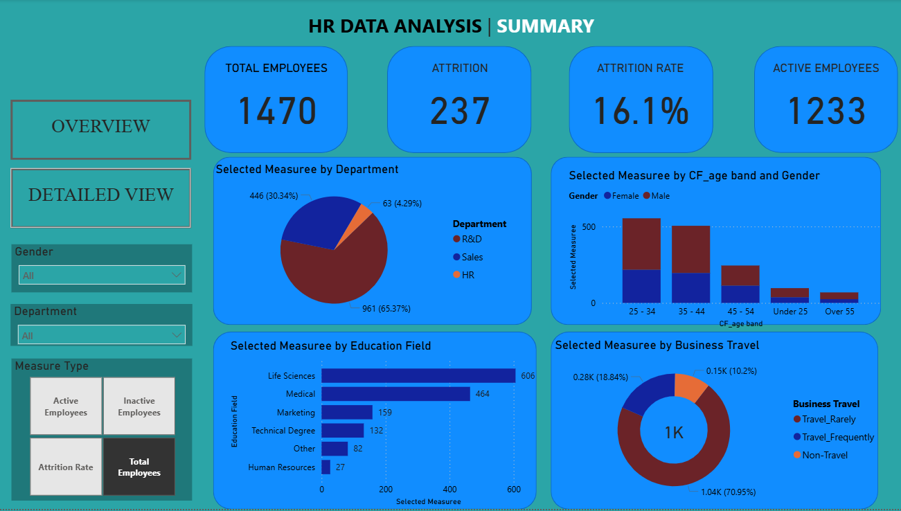
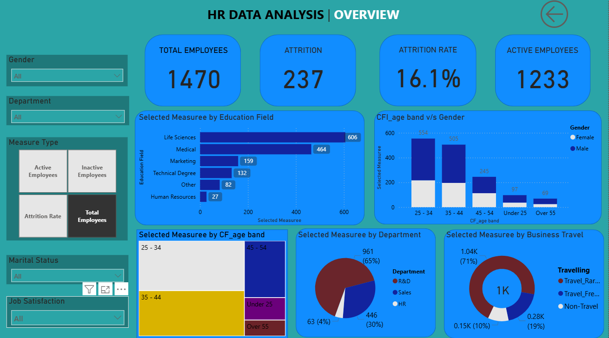
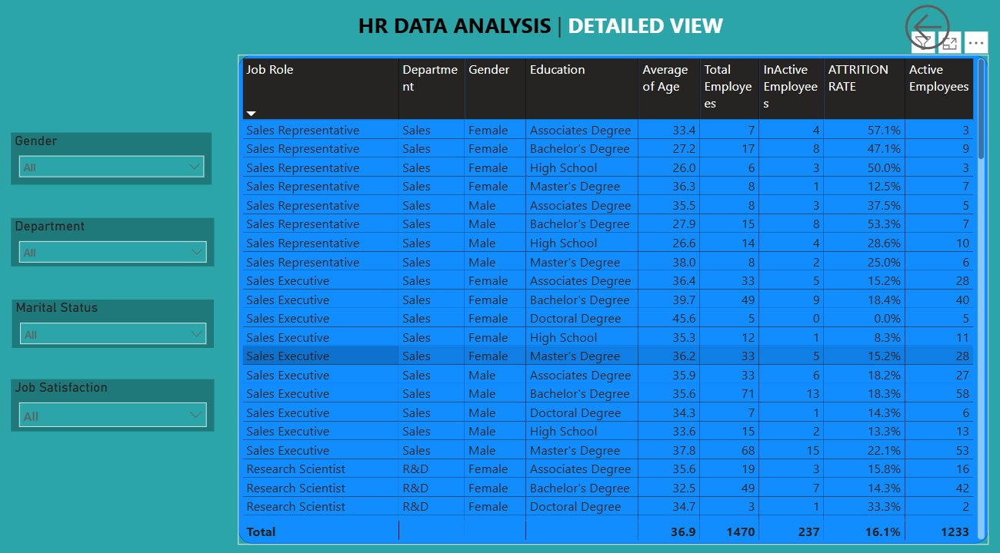

# 📊 Power BI Project: HR Data Analysis Dashboard  

## 📌 Project Overview  
This project analyzes **HR workforce performance** across employees, attrition, demographics, and education fields. The dashboards provide interactive insights into KPIs (total employees, attrition, active employees), **department-wise distribution, age & gender mix, business travel impact**, and detailed employee data—helping HR teams make data-driven decisions.  

The dataset is visualized in **Power BI** to generate meaningful reports and dashboards with filtering and drill-down capabilities.  

---

## 🚀 Key Features  
- **Executive KPI Summary**  
  - Total Employees, Attrition, Attrition Rate, Active Employees.  

- **Department & Education Segmentation**  
  - Employee distribution by **department** (Sales, R&D, HR).  
  - Workforce split by **education fields** (Life Sciences, Medical, Marketing, etc.).  

- **Demographics Analysis**  
  - Age-band vs Gender breakdown.  
  - Marital status & job satisfaction-based filtering.  

- **Business Travel Insights**  
  - Segmentation of employees into **Non-Travel, Rarely Travel, and Frequent Travel** categories.  

- **Detailed Grid View**  
  - Drill-down functionality with filters:  
    - **Job Role**  
    - **Department**  
    - **Gender**  
    - **Education Field**  
    - **Attrition % / Active Employees**  

---

## 📂 Project Structure  
- **Dashboards**: Interactive Power BI dashboards (screenshots included in repository).  
- **Detailed View**: Tabular drill-down report with slicers for deep analysis.  
- **Visuals**:  
  - Donut / Pie Charts  
  - Bar Charts  
  - Stacked Column Charts  
  - KPI Cards  
  - Drill-down Table  

---

## 📸 Dashboard Previews  

### 🔹 Summary Dashboard  
  

### 🔹 Overview Dashboard  
  

### 🔹 Detailed Grid View  
  

---

## 🌐 Live Dashboard  

Click below to explore the **interactive live dashboard** hosted on Power BI:  

[**🔗 View the HR Dashboard**](https://app.powerbi.com/links/l3ArWvVjLq?ctid=4ce8fa72-23e2-4b0c-b5e0-847fff441edd&pbi_source=linkShare)  

---

## 🛠️ Tools & Technologies  
- **Power BI Desktop** – Report & Dashboard Creation  
- **Power BI Service** – Collaboration & Sharing  
- **Data Modeling** – Relationships, Calculated Columns, DAX Measures  

---

## 🎯 Insights Gained  
- **Total Employees:** 1470  
- **Attrition:** 237 (16.1%)  
- **Active Employees:** 1233  
- Majority of employees are from **Life Sciences** and **Medical** fields.  
- **Sales department** shows the highest attrition rate.  
- Most employees are in the **25–34** and **35–44** age groups.  

---

## 📌 How to Use  
1. Clone this repository.  
2. Open the `.pbix` file in **Power BI Desktop**.  
3. Refresh/Connect to the data source (CSV/Excel).  
4. Use slicers to explore:  
   - **Department**  
   - **Gender**  
   - **Education Field**  
   - **Marital Status / Job Satisfaction**  
5. Navigate between **Summary**, **Overview**, and **Detailed View** tabs for different levels of analysis.  

---

## 🤝 Contribution  
Feel free to fork this repo, raise issues, or submit pull requests to enhance visuals, performance, or data model design.  

---

## 📧 Contact  
👤 **Dasappagari Sai Kiran Reddy**  
📩 Email: [dasappagarisaikiranreddy@gmail.com](mailto:dasappagarisaikiranreddy@gmail.com)  
🔗 LinkedIn: [LinkedIn Profile](https://linkedin.com/in/your-profile)  
